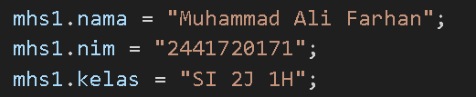

|  | Algorithm and Data Structure |
|--|--|
| NIM |  244107020108|
| Nama |  Fata Haidar Aly |
| Kelas | TI - 1H |
| Repository | [link] (https://github.com/Fata-Haidar/ALSD_Semester2) |

# JOBSHEET 2

# Labs #1 Tinjauan Dasar Pemrograman

## 2.1.1 Solusi Deklarasi Class, Atribut dan Method 

Solusi ini diimplementasikan dalam Mahasiswa09.java, dan berikut ini adalah tangkapan layar hasilnya.

**Penjelasan singkat:** class Mahasiswa09 memiliki 4 atribut dan 4 method:

 Atribut:
1. nim: String 
2. nama: String  
3. kelas: String 
4. ipk: double

Method:
1. tampilkanInformasi(): void 
2. ubahKelas(kelasBaru: String): void 
3. updateIpk(ipkBaru: double): void  
4. nilaiKinerja(ipk: double): String

**Jawab Pertanyaan**
1. Encapsulation dan Inheritance

    a.  Encapsulation: Data dan metode yang berkaitan dikelompokkan dalam satu class untuk menjaga keamanan data.

    b. Inheritance: Class dapat mewarisi atribut dan metode dari class lain untuk menghindari duplikasi kode

2. Terdapat 4 atribut berupa: nim, nama, kelas, dan ipk.
3. Terdapat 4 Method berupa: tampilkanInformasi(), ubahKelas(String kelasBaru), updateIpk(double ipkBaru), dan nilaiKinerja().
4. From

    To

5. Method ini mengevaluasi kinerja mahasiswa berdasarkan nilai IPK dan mengembalikan kategori penilaian sebagai String. Cara kerjanya:

    a. Jika IPK ≥ 3.5 → mengembalikan "Sangat Baik".

    b. Jika IPK ≥ 3.0 dan < 3.5 → mengembalikan "Baik".

    c. Jika IPK ≥ 2.5 dan < 3.0 → mengembalikan "Cukup".

    d. Jika IPK < 2.5 → mengembalikan "Kurang".

6. Commit dan push kode program ke Github.

## 2.1.2. Solusi Instansiasi Object, serta Mengakses Atribut dan Method 

Solusi ini diimplementasikan dalam MahasiswaMain09.java, dan berikut ini adalah tangkapan layar hasilnya.

**Penjelasan singkat:** Ada 5 langkah utama:
1. Intansiasi object (mhs1) dengan constructor default Mahasiswa09().
2. Mengakses atribut nama, nim, kelas, ipk.
3. Mengubah kelas dengan megakses Method ubahKelas().
4. Memperbarui IPK dengan megakses Method updateIPK().
5. Menampilkan Informasi mahasiswa atau object.

**Jawab Pertanyaan**
1. 
object yang dihasilkan adalah mhs1
2. Memanggil atribut dengan nama objek dan dihubungkan dengan operator titik(.).

Memanggil method dengan nama objek dan dihubungkan dengan operator titik(.).

3. * Pemanggilan pertama menampilkan data awal yang diinputkan ke objek mhs1.

    *  Setelah itu, atribut kelas diubah dengan ubahKelas("SI 2K") dan ipk diperbarui dengan updateIPK(3.60).

    * Pemanggilan tampilkanInformasi() kedua menampilkan perubahan tersebut, sehingga hasil outputnya berbeda.

## 2.1.3. Solusi array

Solusi ini diimplementasikan dalam Praktikum_Array.java, dan berikut ini adalah tangkapan layar hasilnya.

**Penjelasan singkat:** Ada 3 langkah utama:
1. Input Nilai Angka 
2. Konversi Nilai Angka ke Nilai Huruf dan Bobot Nilai
3. Menghitung IP (Indeks Prestasi)

## 2.1.4. Solusi fungsi

Solusi ini diimplementasikan dalam Praktiku_Fungsi.java, dan berikut ini adalah tangkapan layar hasilnya.

**Penjelasan singkat:** Ada 3 langkah utama:
1. Menampilkan total pendapatan setiap cabang Royal Garden
2. Menampilkan Stok Bunga Royal Garden 4
3. Menghitung dan Menampilkan Pengurangan Stok Bunga Akibat Bunga yang Mati

## 2.1.5. tugas 1

Solusi ini diimplementasikan dalam Tugas1_JS1_09.java, dan berikut ini adalah tangkapan layar hasilnya.

**Penjelasan singkat:** Ada 3 langkah utama:
1. Input Kode plat Nomor
2. Mencari dan Menampilkan Kota Berdasarkan Kode Plat Nomor
3. Menangani Kode Plat Nomor yang Tidak Ditemukan dan Meminta Input Ulang

## 2.1.6. tugas 2

Solusi ini diimplementasikan dalam Tugas2_JS1_09.java, dan berikut ini adalah tangkapan layar hasilnya.

**Penjelasan singkat:** Ada 5 langkah utama:
1. Menampilkan Menu Pilihan berupa:
    1.Volume kubus
    2.Luas permukaan kubus
    3.Keliling kubus
    4.Keluar 
2. Menerima Input pilihan menu
3. Menerima Input dalam menentukan panjang sisi kubus
4. Melakukan Perhitungan Sesuai Pilihan
    
    Case 1 → Memanggil hitungVolume(sisi) untuk menghitung volume kubus.
    
    Case 2 → Memanggil hitungLuasPermukaan(sisi) untuk menghitung luas permukaan kubus.
    
    Case 3 → Memanggil hitungKeliling(sisi) untuk menghitung keliling kubus.
    
    Default Case → Menampilkan pesan "Pilihan tidak valid." jika input tidak sesuai.
5. Program terus berjalan sampai user memilih 4 untuk keluar.

## 2.1.7. tugas3

Solusi ini diimplementasikan dalam Tugas3_JS1_09.java, dan berikut ini adalah tangkapan layar hasilnya.

**Penjelasan singkat:** Ada 5 langkah utama:
1. Input Jumlah Data Mata Kuliah
2. Input Data Mata Kuliah, berupa Nama Mata Kuliah, Jumlah SKS, Semester ke, Hari Kuliah 
3. Menampilkan Menu Jadwal Kuilah, berupa:
   
    1.Tampilkan Seluruh Jadwal Kuliah 
   
    2.Tampilkan Jadwal Kuliah Berdasarkan Hari Tertentu
   
    3.Tampilkan Jadwal Kuliah Berdasarkan Semester Tertentu
   
    4.Cari Mata Kuliah Berdasarkan Nama Mata Kuliah
   
    5.Keluar
4. Melakukan proses Sesuai Pilihan
   
    Case 1 → tampilkanSeluruhJadwal() untuk menampilkan seluruh jadwal.
    
    Case 2 → Memanggil tampilkanHari(sc) untuk mencari dan menampilkan jadwal mata kuliah sesuai hari yang di inputkan. Juga terdapat validasi apabila input yang di masukkan salah atau data tidak ditemukan.
    
    Case 3 → Memanggil tampilkanSemester(sc) untuk mencari dan menampilkan jadwal mata kuliah sesuai semester yang di inputkan. Juga terdapat validasi apabila input yang di masukkan salah atau data tidak ditemukan.
    
    Case 4 → Memanggil cariMataKuliah(sc) untuk mencari dan menampilkan informasi data jadwal kuliah sesuai dengan Nama Mata Kuliah yang di inputkan. Juga terdapat validasi apabila input yang di masukkan salah atau data tidak ditemukan.
   
    Default Case → Menampilkan pesan "Pilihan tidak valid." jika input tidak sesuai.
5. Program terus berjalan sampai user memilih 5 untuk keluar.

